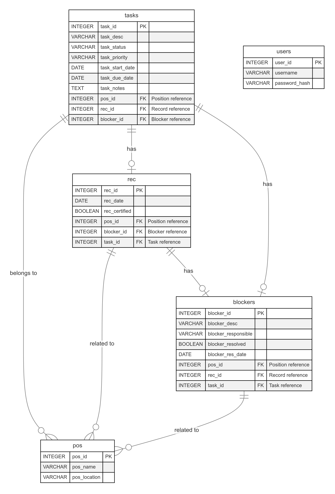
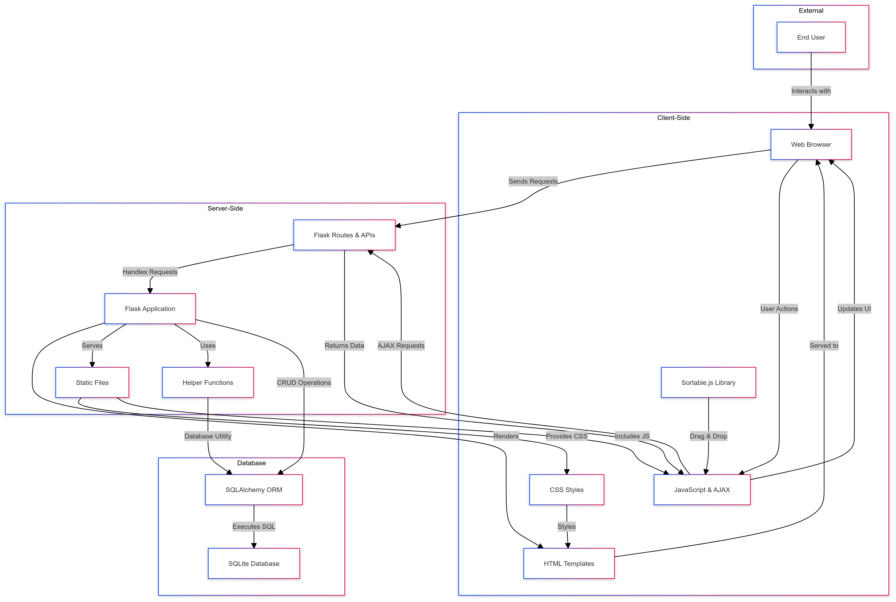
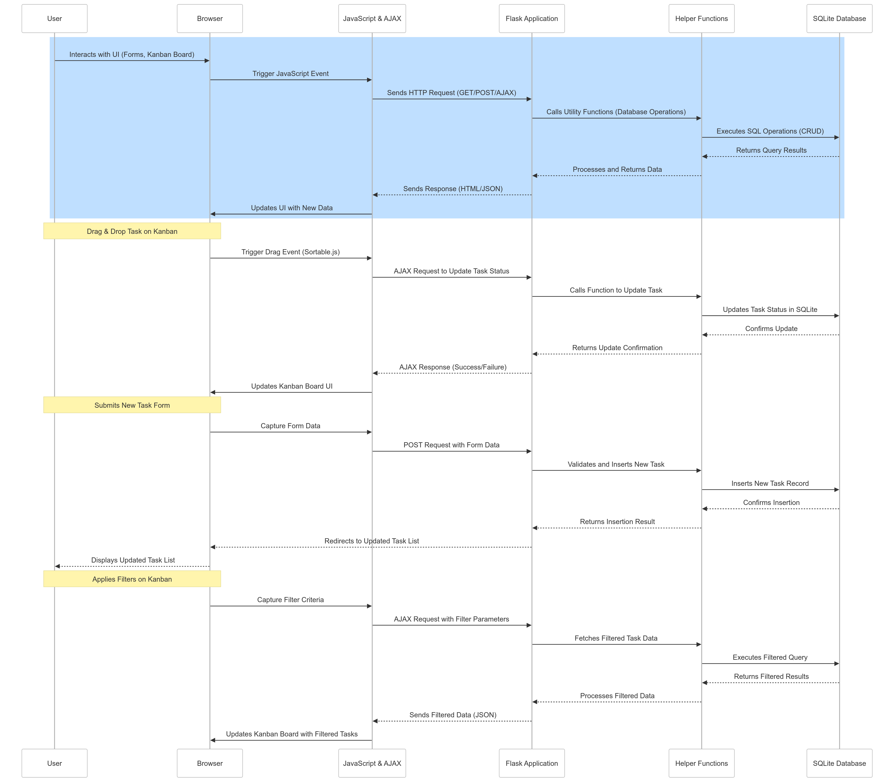

# Architecture Documentation

## Overview

Taskflow is a comprehensive web-based application developed using Python, Flask, SQLAlchemy, HTML, CSS, and JavaScript. It provides an intuitive interface for managing tasks within the accounts payable system of a consumer goods retail chain. The system features task creation, modification, a Kanban board for visual task management, and task filtering. This document outlines the system architecture, including its components, database schema, data flow, and interactions.

## System Architecture

### High-Level Components

1. **Flask Application (`app.py`)**:
   - The main controller of the application, handling routes, user interactions, and RESTful API endpoints.
   - Manages user authentication, task creation, modification, and Kanban board visualization.

2. **Database Layer**:
   - Utilizes SQLAlchemy for ORM to interact with the SQLite database (`taskflow.db`).
   - Manages data persistence for tasks, POS information, user authentication, reconciliation data, and blockers.

3. **Helper Functions (`helpers.py`)**:
   - Provides utility functions for database operations, pagination, data formatting, and session management.
   - Ensures modularity and reusability of code.

4. **Static Files and Templates**:
   - Static assets (`CSS`, `JavaScript`) enhance the visual interface and client-side functionality.
   - HTML templates render the UI, including task forms, tables, and the Kanban board.

5. **Documentation and Scripts**:
   - Various markdown files in the `docs` directory detail the development process, requirements, and user stories.
   - Scripts like `consolidated.py` consolidate the codebase for documentation purposes.

### Directory Structure

- **Project Root**:
  - `README.md`: Provides an overview and setup instructions for the project.
  - `requirements.txt`: Lists Python dependencies required for the project.
  - `consolidated.py`: Script for consolidating code structure into `all_code_structure.txt`.
  - `all_code_structure.txt`: Detailed overview of the codebase.

- **Core Directory (`core/`)**:
  - `app.py`: The main Flask application file.
  - `helpers.py`: Contains utility functions for interacting with the database.
  - `static/`: Contains CSS, JavaScript, and images for frontend assets.
  - `templates/`: Includes HTML templates for rendering different UI components.
  - `taskflow.db`: SQLite database file for data persistence.
  - `flask_session/`: Stores session data.

- **Docs Directory (`docs/`)**:
  - Includes files like `agile_development_process.txt`, `product_backlog.md`, and `project_timeline.md`.

## Application Details

### `app.py`
- **Purpose**: Manages user authentication, task operations, and Kanban board interactions.
- **Key Routes**:
  - `/register`, `/login`, `/logout`: Manage user sessions.
  - `/tasks`, `/create`, `/modify`: Handle task data management.
  - `/kanban`: Provides a visual interface for task management.
  - `/api/...`: Implements endpoints for data retrieval and updating task statuses.

### `helpers.py`
- **Purpose**: Offers utility functions for database operations and session handling.
- **Key Functions**:
  - `get_paginated_tasks()`: Retrieves and paginates tasks.
  - `fetch_pos_data()`: Retrieves POS data for form dropdowns.
  - `format_task()`: Formats task data for display.

### Static Files and Templates

#### **CSS (`style.css`)**
- **Purpose**: Provides visual styling for the application.
- **Key Sections**:
  - General Layout: Establishes a consistent, modern design across the application.
  - Kanban Board: Styles the drag-and-drop interface for visual task management.
  - Task Tables and Forms: Styles for task display and interaction elements.

#### **JavaScript**:
- **`createTasks.js`**:
  - Manages interactivity for task creation, including synchronizing POS fields.
  - Ensures mutual exclusivity for certification checkboxes.
- **`kanban.js`**:
  - Handles Kanban board functionality, including task fetching, filtering, and drag-and-drop status updates.
  - Uses AJAX for dynamic interaction with the server and Sortable.js for drag-and-drop functionality.
- **`modifyTasks.js`**:
  - Manages interactivity for task modification.
- **`tasksLookup.js`**:
  - Enhances task lookup functionality, improving search and filter capabilities.

#### **HTML Templates (`templates/`)**
- **Purpose**: Render dynamic content and form the backbone of the user interface.
- **Files**:
  - **`_create_form.html`**: Partial template for creating tasks, including fields for task description, status, priority, dates, POS selection, and notes.
  - **`_modify_form.html`**: Partial template for modifying tasks, providing fields for editing task details and updating blockers and reconciliation information.
  - **`_kanban_board.html`**: Partial template for rendering the Kanban board columns and tasks, leveraging JavaScript for dynamic updates and drag-and-drop functionality.
  - **`_tasks_body.html`**: Renders the body of the task table, including task descriptions, status, priority, and other details in a tabular format.
  - **`_sidebar.html`**: Sidebar template for filtering tasks, allowing users to filter by POS, date range, status, and priority.
  - **`create.html`**: Full page template for creating new tasks, incorporating the `_create_form.html` partial and listing existing tasks.
  - **`modify.html`**: Full page template for modifying existing tasks, including the `_modify_form.html` partial.
  - **`kanban.html`**: Renders the full Kanban board interface, utilizing the `_kanban_board.html` partial for displaying tasks in different columns.
  - **`tasks.html`**: Displays a paginated list of tasks, including sorting and filtering options, using `_tasks_body.html`.
  - **`layout.html`**: Base layout template used across multiple pages for consistent header, footer, and navigation elements.
  - **`login.html`**, **`register.html`**: Templates for user authentication, providing forms for login and registration.

### Database Schema

#### Overview
- **Database File**: `taskflow.db` (SQLite).
- **Tables**:
  - **`tasks`**: Stores task details including description, status, priority, start and due dates, POS reference, and notes.
  - **`pos`**: Contains POS (Point of Sale) information, such as POS ID and name.
  - **`rec`**: Manages reconciliation data, including dates and certification status.
  - **`blockers`**: Tracks blockers linked to tasks, containing descriptions and the responsible party.
  - **`users`**: Manages user credentials, including username and hashed passwords.

#### Relationships
- **`tasks` Table**:
  - **To `pos` Table**: Each task has a foreign key reference (`pos_id`) to a record in the `pos` table, establishing a many-to-one relationship between tasks and POS entries.
  - **To `rec` Table**: Optionally linked via `rec_id` to provide reconciliation data for tasks. This is a one-to-one relationship, allowing each task to have at most one corresponding reconciliation entry.
  - **To `blockers` Table**: Optionally linked via `blocker_id` to track blockers. This is a one-to-one relationship, allowing a task to have at most one associated blocker entry.
- **`users` Table**:
  - Independent table managing user authentication and session data. It does not directly link to other tables, ensuring separation of user management from task operations.

### Database Schema Diagram

## Data Flow

### User Interaction
1. **Frontend**:
   - Users interact with forms, task lists, and the Kanban board.
   - JavaScript enhances interactivity with AJAX calls, enabling dynamic updates and data synchronization without page reloads.
   - Sortable.js is used for the drag-and-drop functionality on the Kanban board.
   
2. **Backend**:
   - Flask routes handle requests, process data, interact with the database, and render templates.
   - SQLAlchemy ORM executes CRUD operations on the database, managing tasks, POS data, and user authentication.

3. **Database**:
   - The SQLite database stores persistent data, including tasks, POS information, users, and more.
   - Efficient server-side pagination and filtering ensure performance and manageability of task data.

### Core Modules and Their Interactions

#### 1. `app.py` (Main Application)
- Central point for application logic, user interaction, and data handling.
- Collaborates with `helpers.py` for database operations and data formatting.
- Renders templates and interacts with JavaScript through AJAX for a seamless user experience.

#### 2. `helpers.py` (Utility Functions)
- Provides core functions for database interaction, session management, and error handling.
- Enhances code organization and reusability.

#### 3. Static and Template Files
- **CSS**: Ensures a consistent and modern visual design across the application.
- **JavaScript**: Adds interactivity and dynamic functionality, including task filtering, status updates, and drag-and-drop features.
- **HTML**: Uses Jinja2 templating for rendering dynamic content based on server-side data.

### JavaScript Integration
- **AJAX**:
  - Facilitates real-time updates without full page reloads, improving the user experience.
  - Used for fetching task data, updating task statuses, and synchronizing the frontend with the backend.
- **Sortable.js**:
  - Implements drag-and-drop functionality for the Kanban board.
  - Allows users to move tasks between columns and update statuses dynamically.

## Diagrams

### System Architecture Diagram

### Data Flow Diagram

## Conclusion

This Task Management System is architected to be robust, user-friendly, and scalable. By leveraging Flask for server-side logic, SQLAlchemy for database interaction, and client-side technologies like JavaScript, AJAX, and Sortable.js, it offers a highly interactive and efficient platform for managing tasks. This documentation serves as a detailed guide to the system's architecture, providing insights into its components, data flow, and operational logic for future maintenance and development.

